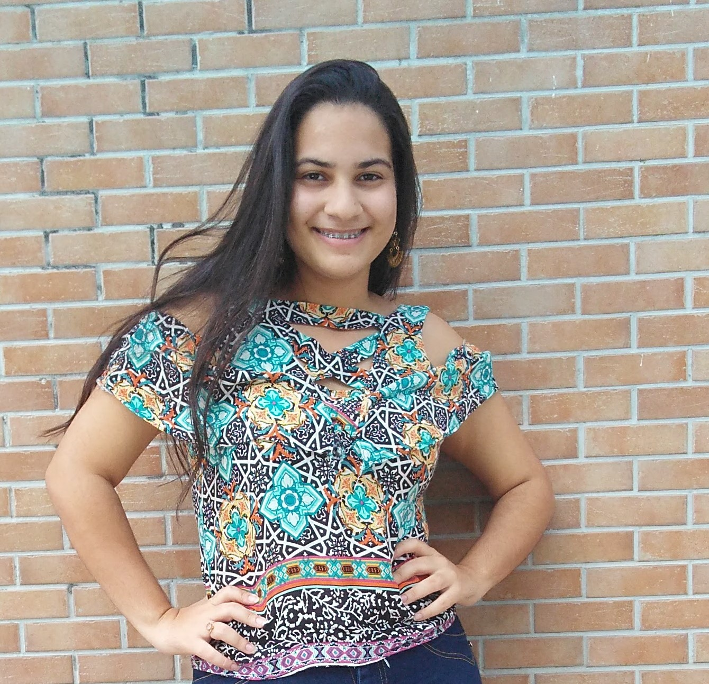
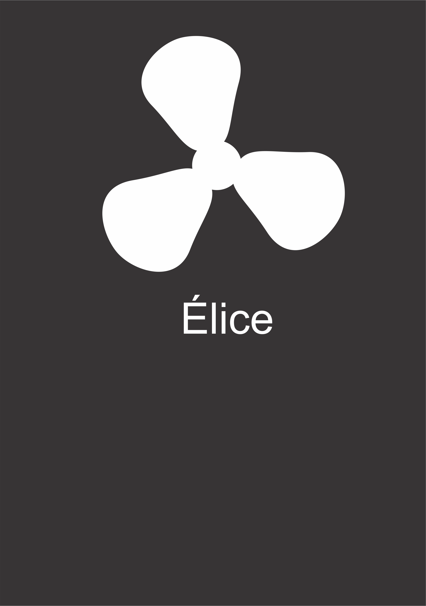
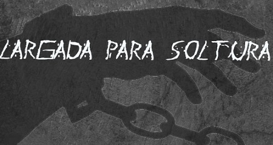
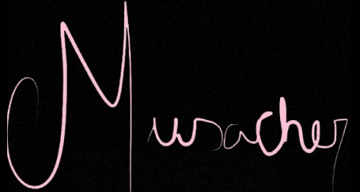
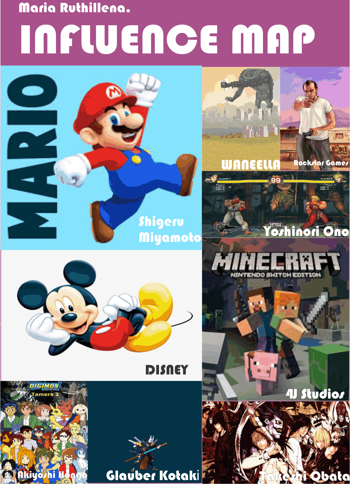
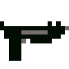

                                                # PORTFÓLIO:

# BIO
  
**Maria Ruthillena, 19. Estudante de Programação de Jogos Digitais do IFRN- campus Ceará-Mirim.  
CV: http://lattes.cnpq.br/4224968954565890    

## EMPRESAS QUE JÁ ATUEI
  

## GAMES
**LARGADA PARA SOLTURA  
DESCRIÇÃO:** Uma aventura estilo arcade com diversos elementos sobre a luta contra a escravidão.  
[Jogo 1 Oficina:Largada para Soltura](https://ruthimaria01.github.io/largada/)  

**MUSACHER  
DESCRIÇÃO:**  Um game investigativo para testar sua capacidade de observação e ao mesmo tempo lhe revelar os sons de diversos instrumentos musicais.  
[Jogo 2 Oficina:Musacher](https://ruthimaria01.github.io/musacher/)  

**PERGAME  
DESCRIÇÃO:** Um quiz indispensável para todo gamer de verdade! Venha testar seu conhecimento sobre o mundo dos jogos eletrônicos.   
[Jogo 3 Oficina:Pergame](https://eliciaa.github.io/Pergame/)  

**IMUNO DEFENSE  
DESCRIÇÃO:** Um quiz indispensável para todo gamer de verdade! Venha testar seu conhecimento sobre o mundo dos jogos eletrônicos.   
[Jogo 4 projeto integrador:Imuno-defense](https://eliciaa.github.io/imuno/)  

## Artes  
**MAPA DE INFLUÊNCIA:**  

**ARTES EM PIXEL 16x16**  
 Personagem masculino.  
  
 Edifícil.
  
 Arma cinza.  
  
 Arma preta.  
  
 Pessoa Morta. 
  
 Detetive.    
  
 Cachorro.  
**
## Apresentações
O projeto foi  Mulheres de Ceará-mirim (1).pdf)[Mulheres de Ceará-Mirim: crítica literária ao acervo produzido por mulheres durante meados do século XIX a início do século XX. apresentado na I Semana de Ciência, Tecnologia e Extensão do IFRN,III Mostra Tecnológica do IFRN (http://eventos.ifrn.edu.br/secitexsc2015/arquivos/horarios-mostra.pdf)nos quais alcançou a etapa final (http://eventos.ifrn.edu.br/secitexsc2015/arquivos/lista-aprovados-iii-mostra-tecnologica.pdf) e na MocitecZN 2015.

## Projetos  
**REALIZADOS:
**.pdf)[Mulheres de Ceará-Mirim: crítica literária ao acervo produzido por mulheres durante meados
do século XIX a início do século XX.]  

RÁDIO CULTURA E VIDA
 Este trabalho foi exclusivo de sala de aula com o objeito de fortificar a cultura da cidade de Ceará-Mirim.
**EM EXECUÇÃO:**
Empreendedorismo S2S: Gameficação de alunos para alunos.  	
 Este projeto pode ser definido como a primeira etapa de um projeto maior para estimular o interesse pelo tema Empreendedorismo, por meio de jogos, entre alunos do nono ano das escolas públicas de Ceará-Mirim. Nesta etapa, os alunos do terceiro ano do curso técnico integrado em jogos digitais do IFRN/Ceará-Mirim, alunos da disciplina Empreendedorismo, desenvolverão conceitos de jogos educativos com o intuito de apresentar, no futuro, de forma lúdica e introdutória, o tema Empreendedorismo. O resultado deste trabalho será a construção de documentos de Game Design a partir do levantamento de dados das escolas.

* * *

** negrito

_ italico

~~ riscado  

   dois espaço p/ pular linha
 3* adciona uma linha horizontal
 #s uma ou mais hashtag criam capitulos ou sub capitulos
 *s asteriscos adciona uma lista não numerada
 1s numeros adcionam uma lista numerada
 
 * * *
contato:
[] [facebook](https://web.facebook.com/maria.ruthillena)   
[Gmail](mariaruthillena.mrf@gmail.com):mariaruthillena.mrf@gmail.com

