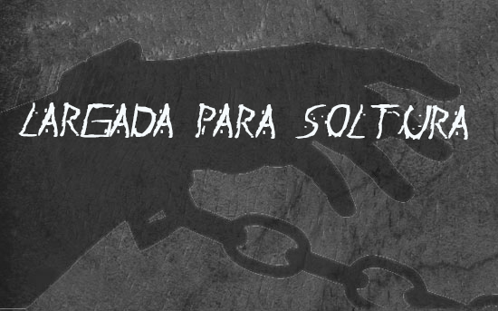
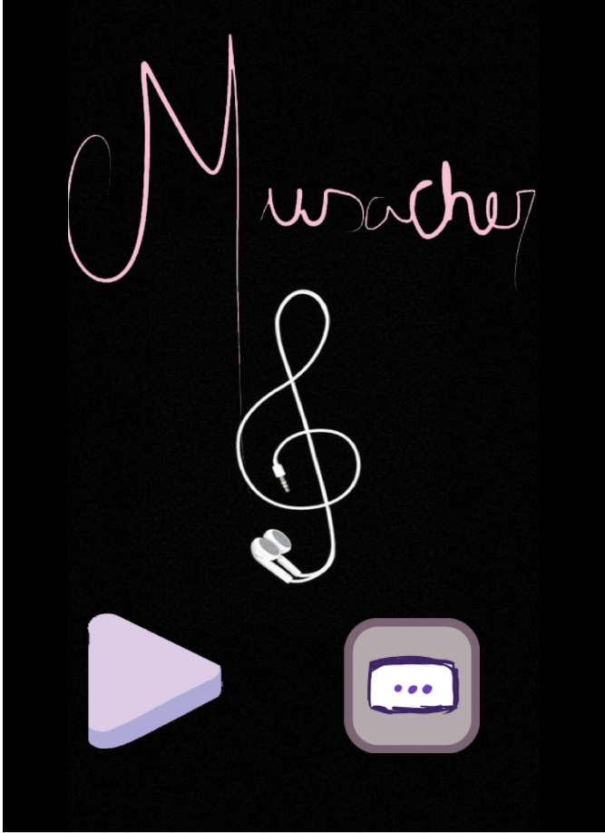
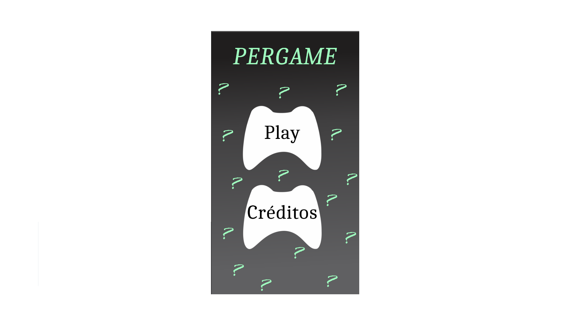

 **Portfólio**

# Quem sou eu?

**Maria Ruthillena, 19. Estudante de Programação de Jogos Digitais do IFRN- campus Ceará-Mirim.
4 Produções**

## GAMES

    [Jogo 1 Oficina:Largada para Soltura](https://ruthimaria01.github.io/largada/)  
    [Jogo 2 Oficina:Musacher](https://ruthimaria01.github.io/musacher/)  
    [Jogo 3 Oficina:Pergame](https://eliciaa.github.io/Pergame/)  

## Artes
[]
## Apresentações
* Aula de Multimidia
* Aula de Motores
* Aula de Game Design

1. Durval
2. Marcelo
3. Thiago

## Projetos

* * *

** negrito

_ italico

~~ riscado  

   dois espaço p/ pular linha
 3* adciona uma linha horizontal
 #s uma ou mais hashtag criam capitulos ou sub capitulos
 *s asteriscos adciona uma lista não numerada
 1s numeros adcionam uma lista numerada
 
 * * *
contato:
[] [facebook](https://web.facebook.com/maria.ruthillena)  
